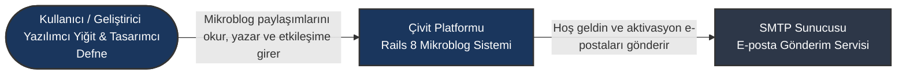
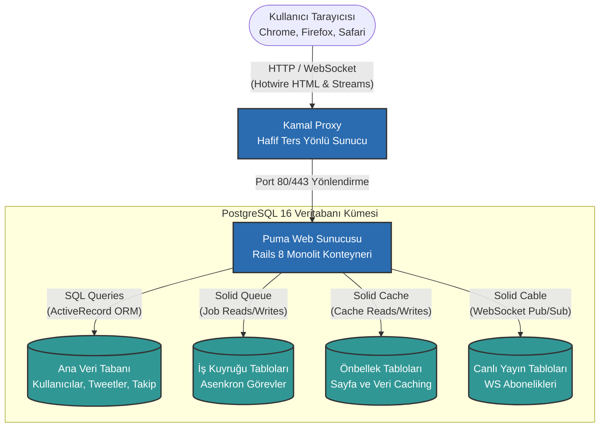
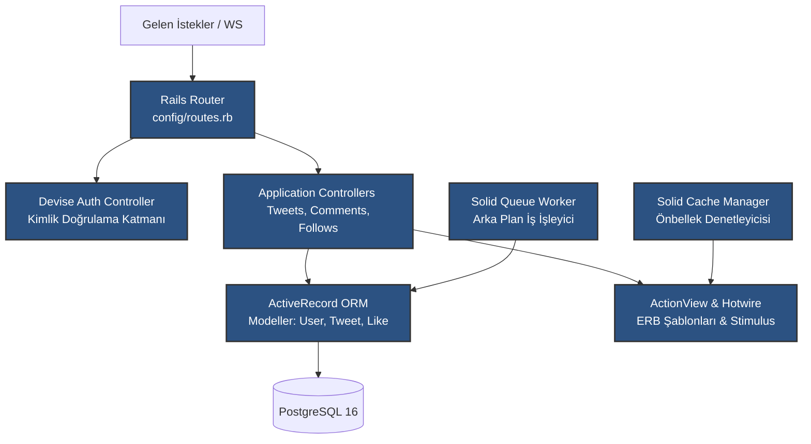

# Çivit (Twitter Clone) - C4 Yazılım Mimari Dokümantasyonu

Bu dokümanda, **Çivit** mikroblog platformunun sistem mimarisi, yazılım mühendisliğinde endüstri standardı kabul edilen **Simon Brown C4 Modeli** kullanılarak 3 farklı detay seviyesinde (Context, Container, Component) tanımlanmış ve görselleştirilmiştir.

---

## 1. Seviye 1: Sistem Bağlam Diyagramı (System Context Diagram)

Sistem Bağlam diyagramı, Çivit platformunun dış dünya ile olan sınırlarını, etkileşime girdiği kullanıcı profillerini ve entegre olduğu harici sistemleri en üst seviyeden (kuş bakışı) tanımlar.

### Eleman Tanımları
* **Kullanıcı / Geliştirici:** Platformun birincil hedef kitlesidir. Tweet yazar, beğenir, yorum yapar ve diğer kullanıcıları takip eder.
* **Çivit Platformu (Sistem):** Tüm iş mantığını barındıran, kullanıcı verilerini yöneten ve Hotwire reaktif ön ucu sunan çekirdek yazılım sistemidir.
* **SMTP Sunucusu (Dış Sistem):** Kullanıcı kayıt süreçlerinde aktivasyon ve şifre sıfırlama e-postalarını asenkron gönderen harici servis.

---

## 2. Seviye 2: Konteyner Diyagramı (Container Diagram)

Konteyner diyagramı, sistemin sınırları içerisine girerek uygulamayı oluşturan bağımsız olarak konuşlandırılabilir (deployable) yazılım bileşenlerini (web sunucusu, veritabanı vb.) ve aralarındaki protokol tabanlı veri akışını gösterir.

### Eleman Tanımları
* **Kullanıcı Tarayıcısı (İstemci):** HTML, CSS ve yerel Stimulus JS denetleyicilerini yorumlayan, Turbo Streams WebSocket akışlarını dinleyen istemci uygulaması.
* **Kamal Proxy (Reverse Proxy):** Sunucuya gelen tüm HTTP/HTTPS isteklerini karşılayan, Let's Encrypt SSL sertifikasını yöneten ve trafiği arka plandaki Puma konteynerine aktaran hafif yönlendirici.
* **Puma Web Sunucusu (Rails 8 Monolit):** Uygulamanın tüm iş mantığını barındıran Docker konteyneridir. HTML şablonlarını sunucu tarafında render eder, WebSocket bağlantılarını yönetir.
* **PostgreSQL 16 Veritabanı:**
  * *Ana Veri Tabanı:* İlişkisel verilerin tutulduğu birincil şema.
  * *Solid Queue Tabloları:* Arka plan işlerinin kuyruklandığı veritabanı tabloları (Solid Stack).
  * *Solid Cache Tabloları:* HTML fragment'larının ve sorgu sonuçlarının önbelleklendiği alan.
  * *Solid Cable Tabloları:* WebSocket kanallarının pub/sub durumunu takip eden tablolar.

---

## 3. Seviye 3: Bileşen Diyagramı (Component Diagram)

Bileşen diyagramı, **Puma Web Sunucusu (Rails 8 Monolit Konteyneri)** içerisindeki yazılım katmanlarını ve sınıflar arası nesne yönelimli bağımlılıkları tanımlar.

### Eleman Tanımları
* **Rails Router:** Gelen HTTP ve WebSocket isteklerini analiz ederek ilgili denetleyiciye (controller) yönlendiren ilk bileşen.
* **Devise Auth Controller:** Oturum açma, şifre sıfırlama ve kayıt işlemlerinin güvenlik denetimlerini gerçekleştiren hazır denetleyici katmanı.
* **Application Controllers:** Tweet oluşturma, yorum ekleme ve takip etme gibi iş mantığı senaryolarını yöneten özel yazılmış denetleyiciler.
* **ActiveRecord ORM:** Modeller (User, Tweet, Comment, Relationship) arasındaki ilişkileri SQL yazmadan yöneten ve veritabanıyla konuşan veri erişim bileşeni.
* **ActionView & Hotwire:** Sunucuda render edilecek dinamik arayüzleri derleyen ve Stimulus niteliklerini HTML'e entegre eden bileşen.
* **Solid Queue Worker:** Asenkron işleri (örn: mailers, background indexers) veritabanından çekip sırayla işleten arka plan işleyicisi iş parçacığı (thread).
* **Solid Cache Manager:** Sık kullanılan şablon parçalarını hızlıca okuyup yazan önbellek yöneticisi.

---

## 🖼️ Derlenmiş Yüksek Çözünürlüklü C4 Tasarım Şeması
Proje sunumunuzda ve raporunuzda kullanabilmeniz için en son sektörel tasarım trendlerine uygun olarak özel tasarlanmış **Blueprint C4 Yazılım Mimarisi Şeması** aşağıda verilmiştir:

