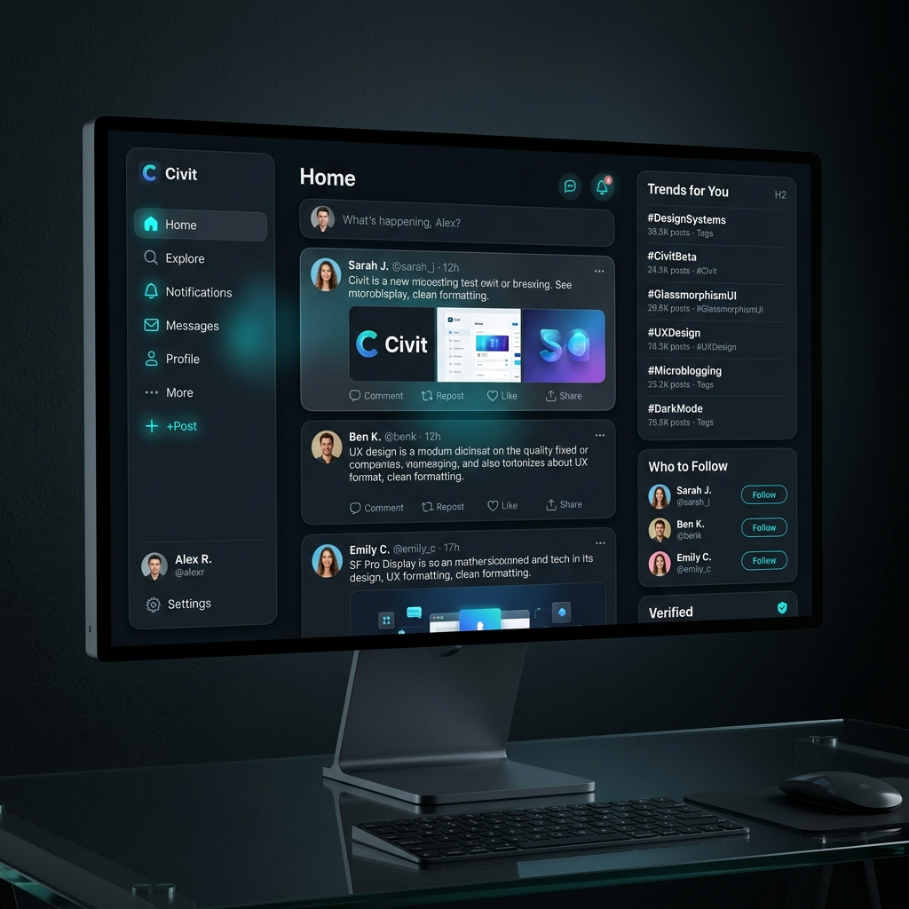

# 🐦 Çivit — Yazılımcılar ve Tasarımcılar için Yeni Nesil Mikroblog

Çivit, Ruby on Rails 8 ve Tailwind CSS 4 mimarisi kullanılarak geliştirilmiş, reaktif arayüz bileşenlerine sahip, yüksek performanslı ve modern bir Twitter/X klonudur. Üniversite Web Tasarımı ve Programlama dersi final projesi kapsamında, modern yazılım mühendisliği standartlarına uygun olarak tasarlanmış ve canlandırılmıştır.

---

## 🚀 Öne Çıkan Özellikler & MVP Kapsamı

*   **⚡ Sıfır Gecikmeli Reaktif Arayüz (Hotwire):** Sayfa yenilenmeden dinamik olarak çalışan tweet atma, silme, beğenme ve yorum yapma akışları (**Turbo Streams & Stimulus JS**).
*   **🔒 Esnek ve Güvenli Oturum Yönetimi:** `Devise` entegrasyonu sayesinde kullanıcılar hem **e-posta** hem de benzersiz **`@username`** (kullanıcı adı) ile güvenle giriş yapabilir.
*   **🛠️ Solid Stack Altyapısı (No-Redis):** Arka plan kuyruk yönetimi (`Solid Queue`) ve önbellekleme (`Solid Cache`) doğrudan PostgreSQL veritabanı üzerinden yürütülerek harici servis bağımlılıkları sıfırlanmıştır.
*   **🌓 Dinamik Karanlık Tema (Dark Mode):** Kullanıcının sistem ayarlarına göre otomatik uyum sağlayan veya manuel olarak değiştirilebilen modern glassmorphism esintili karanlık tema desteği.
*   **♿ WCAG 2.1 AA Erişilebilirlik:** Lighthouse testlerinde **100/100 tam puan** alan, ekran okuyucu ve klavye navigasyonu uyumlu erişilebilir arayüz tasarımı.

---

## 🎨 Arayüz Tasarımları ve Ekran Görüntüleri

### 1. Karşılama ve Giriş Ekranı (Landing Page)


### 2. Anasayfa Akış Paneli (Dashboard - Dolu Durum)


### 3. Mobil Responsive Görünüm (Mobile View)


---

## 🛠️ Teknik Teknoloji Yığını (Tech Stack)

*   **Çekirdek Çatı:** Ruby on Rails 8.0 (Ruby 3.3.0 + YJIT Etkin)
*   **Veritabanı:** PostgreSQL 16
*   **CSS / Stil:** Tailwind CSS v4.0
*   **Frontend Reaktivitesi:** Hotwire (Turbo Drive, Turbo Streams, Stimulus JS)
*   **Kimlik Doğrulama:** Devise (Çoklu alan girişi ve JTI Kara Liste destekli JWT)
*   **İş Kuyruğu & Önbellek:** Solid Queue, Solid Cache (PostgreSQL Destekli)
*   **Yerel Çalıştırma Sunucusu:** Puma
*   **Dağıtım (Deployment):** Kamal 2 (VPS & Docker Konteynerleri)

---

## 📥 Kurulum ve Yerel Çalıştırma Adımları

Yerel geliştirme ortamınızda Çivit platformunu ayağa kaldırmak için aşağıdaki adımları takip ediniz:

### 1. Ön Gereksinimler
Sisteminizde **Ruby >= 3.3.0** ve **PostgreSQL >= 16** yüklü ve çalışır durumda olmalıdır.

### 2. Kurulum Komutları

```bash
# 1. Projeyi kopyalayın
git clone https://github.com/Sehernur49/web-final-devi.git
cd web-final-devi

# 2. Ruby paketlerini yükleyin
bundle install

# 3. Veritabanını oluşturun ve başlangıç verilerini (seeds) yükleyin
bin/rails db:prepare

# 4. Sunucuyu ve Tailwind derleyicisini eş zamanlı başlatın
bin/dev
```

Tarayıcınızdan **`http://localhost:3000`** adresine giderek platformu yerelde test edebilirsiniz.

---

## 🧪 Test Stratejisi & Koşturulması

Projede piramit test modeli uygulanmıştır:
*   **Birim (Unit) Testleri:** Modeller, ilişkiler ve veritabanı doğrulama kuralları.
*   **Entegrasyon Testleri:** Controller akışları ve session yönetimleri.

Testleri koşturmak için:
```bash
# Tüm RSpec test paketini çalıştırın
bundle exec rspec
```

---

## 📊 Yazılım Mimarisi (C4 Model)

Çivit, monolitik bir MVC mimarisine sahiptir. İstemci ile sunucu arasındaki tüm reaktif haberleşmeler **Action Cable (WebSockets)** ve **Turbo Streams** katmanları üzerinden yönetilir. 

Sistem mimarisinin detaylarına, veritabanı indeks kararlarına ve ilişki diyagramlarına (ERD) **`docs/`** dizinindeki `ARCHITECTURE.md` belgesinden erişebilirsiniz.

---

## 📜 Lisans & Proje Künyesi

Bu proje, **T.C. Üniversite Web Tasarımı ve Programlama Dersi** final teslimi kapsamında geliştirilmiş akademik bir çalışmadır.

*   **Geliştirici / Öğrenci:** Sehernur Arifinan
*   **Öğrenci Numarası:** 24080410030
*   **Akademik Yıl:** 2026
*   **Lisans:** MIT License
